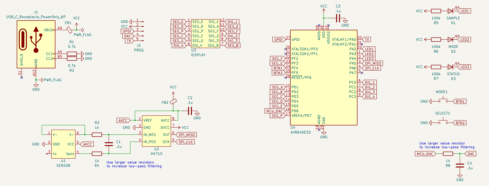
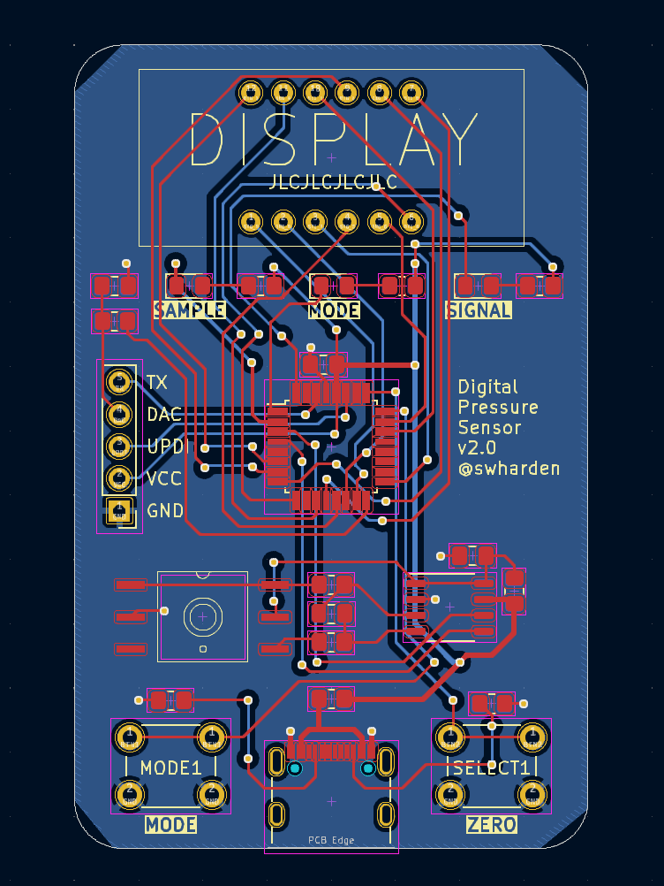
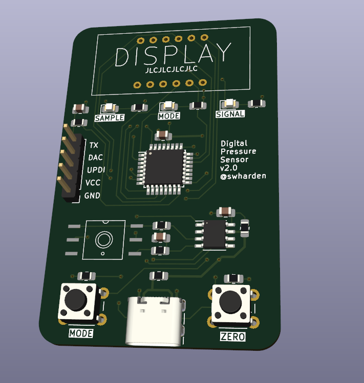

# Digital Pressure Sensor

This project contains design files for a minimal complexity digital pressure sensor. It uses a [HX710](https://image.micros.com.pl/_dane_techniczne_auto/uphx710b%20smd.pdf) 24-bit ADC to read differential voltage across a Whetstone bridge pressure sensor, then an [AD64DD32](https://ww1.microchip.com/downloads/aemDocuments/documents/MCU08/ProductDocuments/DataSheets/AVR64DD32-28-Prelim-DataSheet-DS40002315B.pdf) applies signal filtering in software and outputs the result as an analog signal using its built-in DAC. Filtering in software allows filter settings and recording modes to be adjusted in real time or further modified using firmware updates. Pressure is displayed on a multiplexed 7-segment display driven directly by pins of the microcontroller. Display mode can be toggled between pressure value, wave period, or wave frequency.

### Version 1.0

### Version 2.0

#### Build Notes

* Through-hole buttons have leads out the bottom which fight against adhesive pads at the corners
* PCB near display could be notched to facilitate string or zip tie mounting vertically
* I'm unsure whether I like the USB connector on the bottom. The whole board could be turned upside down with the connector and buttons on the top.