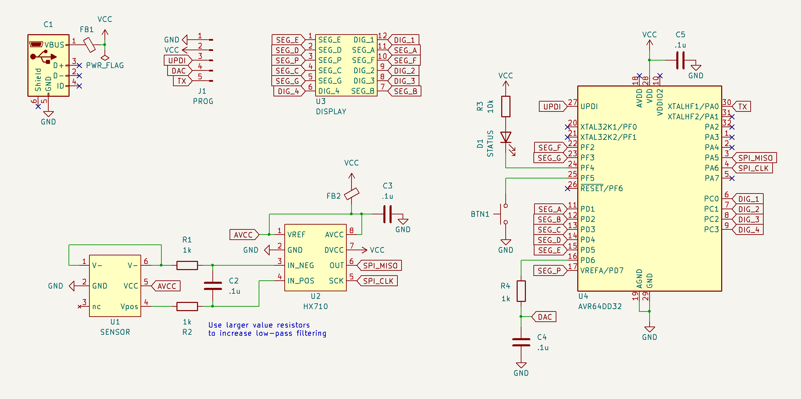
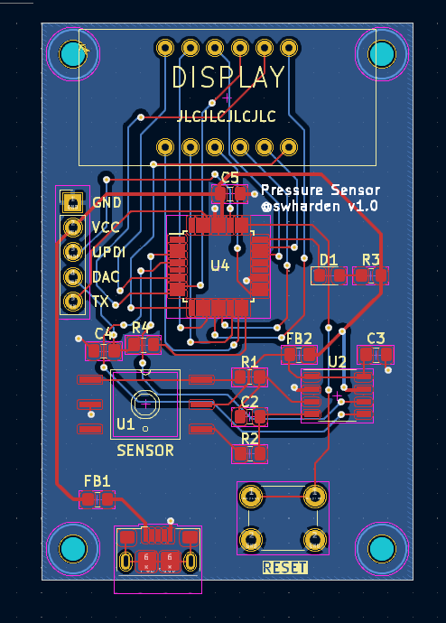
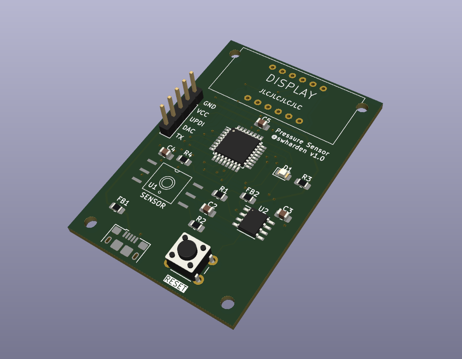

# Pressure Sensor

This project contains design files for a minimal complexity digital pressure sensor. It uses a 24-bit ADC to read differential voltage across a Whetstone bridge pressure sensor, then an [AD64DD32](https://ww1.microchip.com/downloads/aemDocuments/documents/MCU08/ProductDocuments/DataSheets/AVR64DD32-28-Prelim-DataSheet-DS40002315B.pdf) applies high-pass and low-pass filtering in software and outputs the result as an analog signal using its built-in DAC. Filtering in software allows filter settings and recording modes to be adjusted in real time or further modified using firmware updates.

