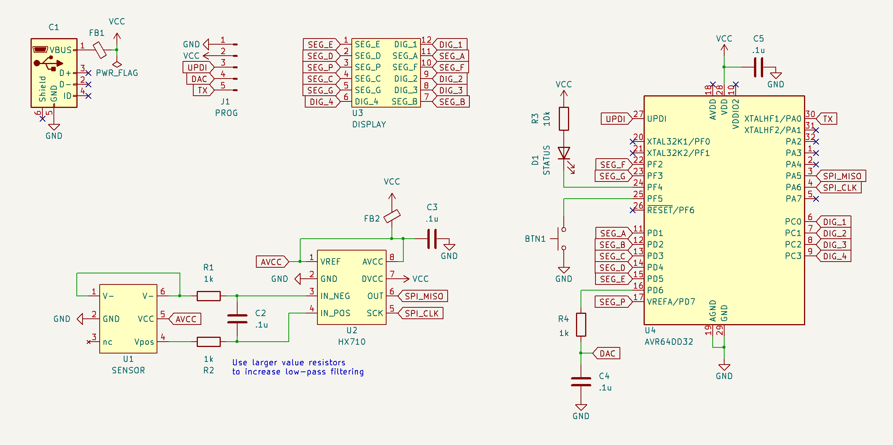
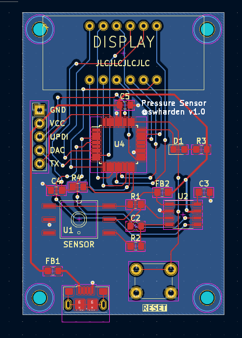
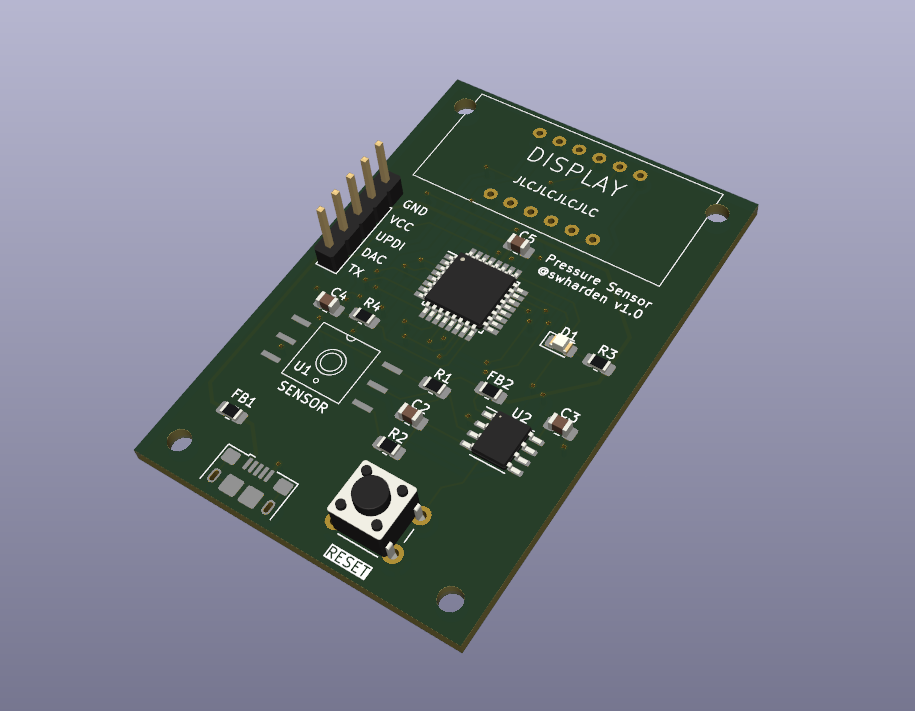
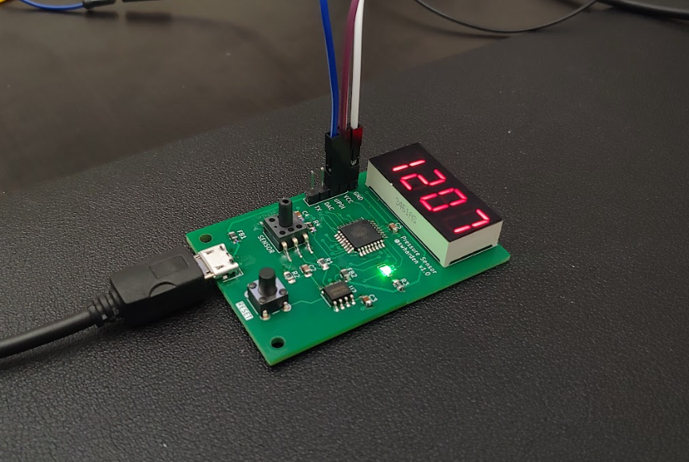

# Pressure Sensor

This project contains design files for a minimal complexity digital pressure sensor. It uses a 24-bit ADC to read differential voltage across a Whetstone bridge pressure sensor, then an [AD64DD32](https://ww1.microchip.com/downloads/aemDocuments/documents/MCU08/ProductDocuments/DataSheets/AVR64DD32-28-Prelim-DataSheet-DS40002315B.pdf) applies high-pass and low-pass filtering in software and outputs the result as an analog signal using its built-in DAC. Filtering in software allows filter settings and recording modes to be adjusted in real time or further modified using firmware updates.

### Version 1.0

### Version 2.0

In development...

### Components
* [tinted window film](https://www.amazon.com/dp/B07FBZ7NML/)

### Notes for Future Builds
* Use a USBC connector
* Add test pads for GND and DAC
* Add current limit resistors for each segment
* Use a SMT zero button
* Use a separate mode button
* Add more LEDs: power, dV, status
* Green LEDs need >47Ω to look nice
* Use rounded edges
* Drill holes not necessary